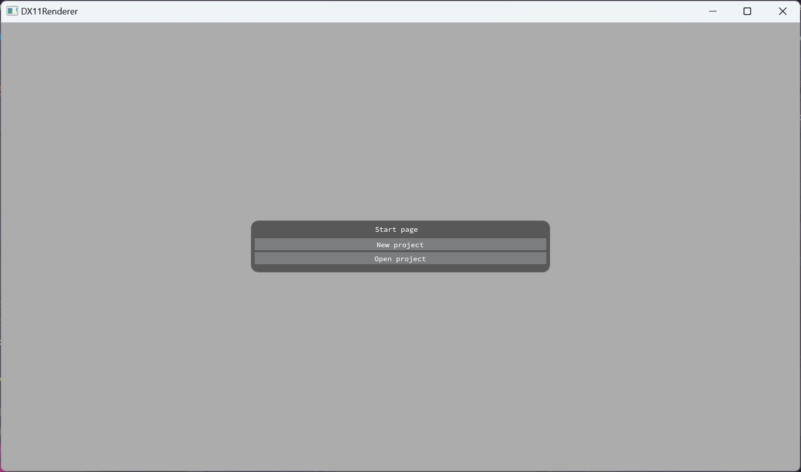
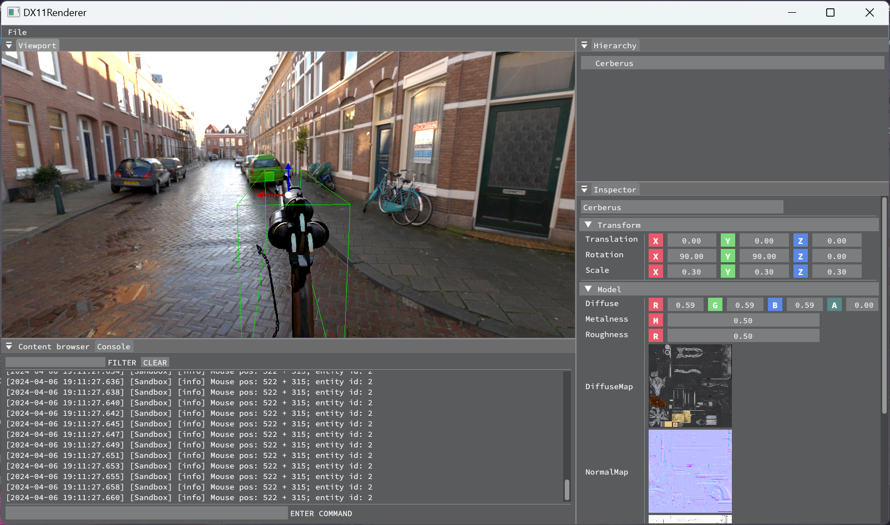

# Introduction
A toy renderer based DirectX API, including an engine library and an editor.




# Features
- Deferred physically based rendering pass
- Directional lighting and image-based lighting
- Variance shadow map, Exponential shadow map, exponential variance shadow map
- Temporal anti-aliasing
- Asset manager system
- Entity component system
- Gizmos

# Requirement 
Require to compile on Windows platform, make sure to install dependencies as follows:
- A compiler supporting C++20 standard, recommended MSVC
- CMake, version 3.15 above
- Windows SDK, which includes DirectX sdk

# Getting started
Firstly, clone repository:
```shell
git clone https://github.com/YUZHIGUIYI/DirectXToy.git --depth=1
```
Secondly, update submodules
```shell
cd ./DirectXToy
git submodule init
git submodule update
```
Thirdly, build this project
```shell
cmake -B -DCMAKE_BUILD_TYPE=release build
cmake --build build --config=release
```
Finally, run the executable file
```shell
./bin/Sandbox.exe
```

# Third parties
- [GLFW](https://github.com/glfw/glfw): A multi-platform library for OpenGL, OpenGL ES, Vulkan, window and input
- [spdlog](https://github.com/gabime/spdlog): Fast C++ logging library.
- [Dear ImGui](https://github.com/ocornut/imgui): Bloat-free Graphical User interface for C++ with minimal dependencies
- [stb](https://github.com/nothings/stb): stb single-file public domain libraries for C/C++
- [assimp](https://github.com/assimp/assimp): The official Open-Asset-Importer-Library Repository. Loads 40+ 3D-file-formats into one unified and clean data structure.
- [entt](https://github.com/skypjack/entt): Gaming meets modern C++ - a fast and reliable entity component system (ECS) and much more